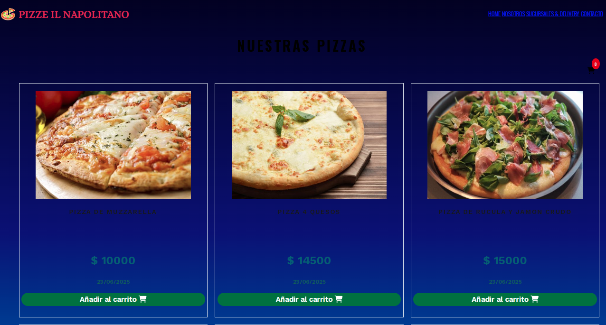
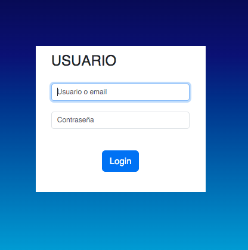
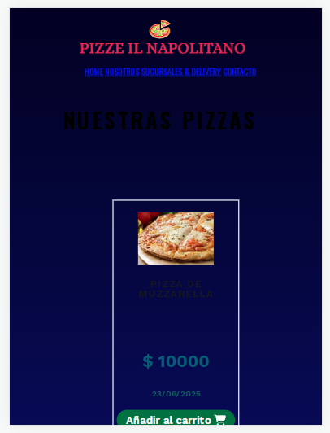

# Proyecto Pizzeria

Aplicación web que presenta un catalogo de pizzas con funcionalidad de carrito de compras, permitiendo a los usuarios agregar productos y ver el total de su pedido.

## Tecnologías utilizadas
- Desarrollado con HTML5/CSS3
- Diseño responsive
- Vanilla JavaScript
- Animate.css para animaciones

## Funcionalidades del carrito

- Agregar productos con un solo click
- Prevención de duplicados
- Controlador visual de productos
- Cálculo automático del total
- Indicador visual cuando un producto es agregado

## Screenshots

## Autor

- [@maxidinamero] (https://github.com/maxidinamero)

## License

[MIT](https://choosealicense.com/licenses/mit/)

